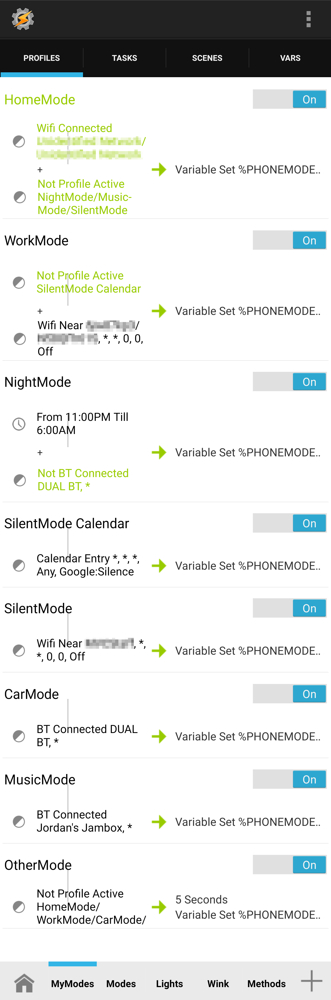
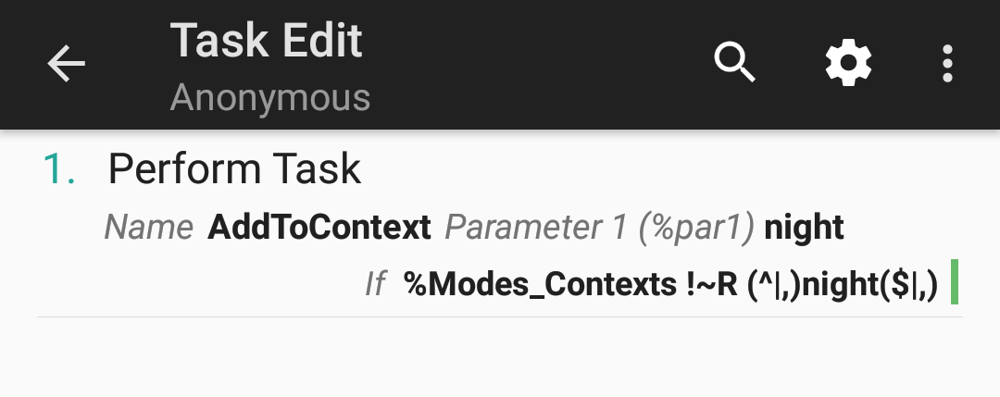

One of the frequent uses of Tasker is to change system settings and perform tasks based on your current situation.
Things like silencing your phone while in a meeting, turning down brightness at night, or launching a music app
when in the car are just the tip of the iceberg when it comes to Tasker automation. This sort of automation can
be approached in many different ways and often times leads to repeated steps in multiple tasks and disorganization.

Over time I have strived to refine my situation-based automation so that it's easy to modify, highly organized, and
doesn't use the same steps in multiple tasks. I have now also made it universal so that anyone can import my simple
profiles and quickly get automating.

See the technical details below and the examples from my own setup to help paint the full picture of how this framework can be beneficial to you.

[Installation and Configuration (and upgrades)](#installation-and-configuration)  
[Configuration Spec](#configuration-spec)  
[Examples](#examples)

# Overview
This framework monitors a variable `%Modes_Contexts` which contains a list of your current, active contexts i.e. if you are home, if you have headphones plugged in, if you are in a work meeting, etc. These contexts are up to you to think of and manage based on your needs. The framework looks at the configuration for these contexts and based on priorities and context types will determine what your current settings should be and sets them accordingly. Also when a context becomes active or inactive you can easily run other tasks or enable/disable other profiles accordingly.

To activate a context, simply call the `AddToContext` task with the name of the context as the first parameter. The `ContextChanged` profile will pickup the change and read the configurations for all active contexts. Configuration file names should match the context names in Tasker i.e. if you have a context named `home`, the framework will look for a configuration file named `home.json` for its configuration.

If multiple contexts are active, the framework does a few things to determine how the device settings should be set. Only the highest priority `primary` context (see the [configuration spec](#configuration-spec) section for a description of `primary` vs `secondary` contexts) will be used. If there is a tie for highest priority, then the last to be activated will be used. All `secondary` contexts with a priority higher than the primary context will be used, and settings from higher priority contexts will take precidence over lower priority contexts if they change the same setting. Also, any `secondary` context's settings will take precidence over `primary` context's settings even if they share the same priority.

**Supported Settings**  
Out of the box the following settings changes are supported:

* Notification Volume
* Media Volume
* Do Not Disturb Mode
* Location Mode+
* Wifi on/off
* Bluetooth on/off
* Airplane Mode on/off
* Display Rotation on/off
* Display Timeout
* Display Brightness
* Haptic Feedback on/off+
* Battery Saver on/off+
* And much more\*

\+ *Requires you to grant Tasker the `WRITE_SECURE_SETTINGS` permission. Instructions [here](https://tasker.joaoapps.com/userguide/en/help/ah_secure_setting_grant.html)*  
\* *With the ability to call any task or enable/disable any profile, you can modify anything else that Tasker is able to modify.*

# Framework Advantages Over Standard Tasker Profiles
1. Profile conflict management
    
    With standard profiles if you want to avoid a profile being active while another is active you have to do some sort of check, like `%PACTIVE` regex matching the other profile name(s) or set a custom global variable with a value when the other profile is active and add that as a condition to your profile. With this framework you don't need those checks because the `type` and `priority` properties handle that for you, so you can create profiles with a simple, single condition and let the framework handle the rest.

1. Configuration merging

    With this framework, since multiple contexts can be active at once, your configurations for each state will be merged and the highest priority for each setting will take affect. When one of the states is deactivated, the settings are re-merged and changed accordingly. Doing this with normal profiles and tasks would be quite the challenge because you would have to write lengthy exit conditions, or a really big, nasty task to handle the changes. See the next point...

1. One task (and a few helpers) to take care of all the work

    When you use normal profiles and tasks to change settings dependent on your situation, you either have to create one giant task with a lot of `if` statements in it, or each profile has a task with a lot of the same steps repeated in them. With this framework you can change a bunch of settings without creating any extra tasks and all the logic is written in JavaScript which is a lot easier to work with than Tasker's.


# Installation and Configuration

1. ### Import Modes.prj.xml into Tasker
    **The easy way to install is to head to the [Taskernet url](https://taskernet.com/shares/?user=AS35m8k7601Z2ol5UAzuT033Ll5H1yhruZrDvDITEN2l4b5o%2Fm1AF9Dpj3WrfO36Pgh2&id=Project%3AModes) for the project to install.** If you'd like to install the project manually, long press (or right click) and save the [Modes.prj.xml file](https://raw.githubusercontent.com/jhotmann/tasker-phone-modes/master/Modes.prj.xml) to your phone.
    Then open up Tasker, long press on a project tab at the bottom, and select Import. Then browse to and select the downloaded file.

    The same Taskernet url can be used for **upgrades**. Select `Import`, then `YES` on the resulting Import dialog, then `YES` when asked to overwrite the existing `Modes` project, let Tasker do its import process, you can select `NO` or `OK` on the Missing Permissions dialog, select `NO` when asked to enable all profiles, and lastly select `YES` when asked if you want to run the Setup task.

1. ### Run Setup task
    If installing from Taskernet you will be prompted to run the Setup task, otherwise select the Tasks tab for the Modes project in Tasker and open the Setup task. Select the play button and follow the on-screen prompts. It will ask you for the location you store your config files, a default context when no other primary contexts are active, and if you'd like to periodically check for updates.

1. ### Create config files
    As of version `1.2.0` there is a [Configuration Creator webpage](https://rawgit.com/jhotmann/tasker-phone-modes/master/ConfigCreator/ConfigCreator.html) that you can use to generate a json file and download to your device. There is also a `ConfigCreator` task that can be used to launch the configuration creator webpage so you don't need to bookmark the URL. You can also see the [Configuration Spec](#configuration-spec) section for manual config creation.

1. ### Create profiles and tasks to change the current context

    Create profiles and tasks *outside of the Modes project (so they don't get overwritten)* that determine when context changes have occurred. The name of your config files are important because they need to match a context's name. When the `home` context is active, `home.json` is used to lookup the settings for the `home` context. You can activate/deactivate contexts within a task or with a profile. I personally use profiles to handle the majority of context changes but tasks can be used as well.

    To activate a context, simply call the `AddToContext` task with the name of the context as the first parameter, and to deactivate a context call the `RemoveFromContext` task with the name of the context as the first parameter.

    *See the [Examples](#examples) section for my real world configuration files and profiles.*

# Configuration Spec
The configuration files each contain a single JSON object with the following properties. All properties are optional and a few have default values if they are not specified. If you omit a property that doesn't have a default value from your configuration, that setting will remain unchanged.

* `type` - whether the context is a primary or secondary type
  * `1` - a primary context (default). Think of a primary context as a place like home, work, car, etc. Primary contexts often contain multiple settings changes and possibly running other tasks or enabling/disabling other profiles. Only one primary context can be active at a time.
  * `2` - a secondary context. Think of a secondary context as a state that takes place within another context or can span multiple primary contexts like headphones plugged in, specific apps being open, or night time. Secondary contexts often change just a few settings like going into do not disturb mode when in a meeting. Multiple secondary contexts can be active at a time.
* `priority` - to determine what context(s) take priority when multiple are active
  * An integer from `0` to `100`
  * The default is `50`
* `volume_notification` - set the notification volume
  * An integer from `0` to `7`
  * I believe manufacturers can change how many volume steps there are so the max number could be different on your device
* `volume_media` - set the media volume
  * An integer from `0` to `15`
  * I believe manufacturers can change how many volume steps there are so the max number could be different on your device
* `dnd` - set the Do Not Disturb mode
  * `"all"` - Do Not Disturb off
  * `"priority"` - Priority-only
  * `"alarms"` - Alarms-only
  * `"none"` - Total silence
* `location` - change the location mode
  * `"off"` - location services off
  * `"accuracy"` - high accuracy mode (uses GPS, Wifi, Bluetooth, and mobile networks)
  * `"battery"` - battery saver mode (uses Wifi, Bluetooth, and mobile networks)
  * `"device"` - device-only mode (uses GPS and other device sensors only)
* `wifiOn` - turn Wifi on or off
  * `true` - turns Wifi on
  * `false` - turns Wifi off
* `bluetoothOn` - turn Bluetooth on or off
  * `true` - turns Bluetooth on
  * `false` - turns Bluetooth off
* `airplaneModeOn` - turns airplane mode on or off
  * `true` - turns airplane mode on
  * `false` - turns airplane mode off
* `screenRotationOn` - turns display rotation on or off
  * `true` - turns display rotation on
  * `false` - turns display rotation off
* `displayTimeout` - set the display timeout in minutes
  * An integer from `1` to ???
  * I'm not sure what the maximum timeout is
* `displayBrightness` - change the display brightness
  * An integer from `0` to `255`
  * `"auto"` will restore auto brightness
* `hapticFeedbackOn` - turns haptic feedback on or off
  * `true` - turns haptic feedback on
  * `false` - turns haptic feedback off
* `batterySaverOn` - turns battery saver on or off
  * `true` - turns battery saver on
  * `false` - turns battery saver off
* `enter` - profiles to enable/disable and tasks to run when the context is activated
  * An object containing any of the following properties
    * `profilesToDisable` - an array of profile names to disable: `["ProfileName1", "ProfileName2"]`
    * `profilesToEnable` - an array of profile names to enable: `["ProfileName3", "ProfileName4"]`
    * `tasksToRun` - an array of objects containing tasks to run and their parameters
      * `name` - the name of the task (string), example: `"TaskName1"`
      * `priority` - the task priority (integer), example" `10`
      * `param1` - the first parameter to pass to the task (string), examples: `""` or `"SomeValue"`
      * `param2` - the second parameter to pass to the task (string)
* `exit` - profiles to enable/disable and tasks to run when the context is removed
  * An object containing the same properties as `enter`

If you'd like to create configuration files manually instead of using the [Configuration Creator webpage](https://rawgit.com/jhotmann/tasker-phone-modes/master/ConfigCreator/ConfigCreator.html), the base.json file can be used as a template. I have also included several of my config files in the [config directory](https://github.com/jhotmann/tasker-phone-modes/tree/master/config) as
    examples that you can modify to your needs.  I would recommend using a computer for this. Once you are satisfied with your
    configuration, copy your config files to `/sdcard/Tasker/ModeConfigs` (which is the default, you can also specify a different location during the setup)
    and begin playing around with your different modes.

`base.json` - the template for creating new configurations

```json
{
  "type": "null or integer (1 for primary or 2 for secondary)",
  "priority": "null or integer (0-100)",
  "volume_notification": "null or integer (0-7)",
  "volumn_media": "null or integer (0-15)",
  "dnd": "null, all (with quotes to turn off dnd), priority (with quotes for priority only), alarms (with quotes for alarms only), or none (with quotes for total silence)",
  "location": "null, off (to turn off location), accuracy (for High Accuracy), battery (for Battery Saver), or device (for Device Only)",
  "wifiOn": "null or boolean",
  "bluetoothOn": "null or boolean",
  "airplaneModeOn": "null or boolean",
  "screenRotationOn": "null or boolean",
  "displayTimeout": "null or integer (1+, display timeout in minutes)",
  "displayBrightness": "null, auto, integer (0-255)",
  "hapticFeedbackOn": "null or boolean",
  "batterySaverOn": "null or boolean",
  "enter": {
    "profilesToDisable": ["NameOfProfile1", "NameOfProfile2", "..."],
    "profilesToEnable": ["NameOfProfile3", "NameOfProfile4", "..."],
    "tasksToRun": [{
      "name": "TaskName1",
      "priority": 10,
      "param1": "",
      "param2": ""
    }, {
      "name": "TaskName2",
      "priority": 10,
      "param1": "",
      "param2": ""
    }]
  },
  "exit": {
    "profilesToDisable": [],
    "profilesToEnable": [],
    "tasksToRun": []
  }
}
```

When a property is omitted, left null, or is an empty array `[]`, that setting is left unchanged. Things like `null`, `true`, `false`, and integers (`1`, `2`, `42`)
should never have quotes around them. `"Strings"` should always use double quotes. Proper indenting is nice but optional.

# Examples
Here is how I use this framework to automate the settings on my phone. *Note, I store all my profiles and tasks that control phone contexts in a separate Tasker project than the Modes project. This makes updating the Modes project seamless.*



I have a primary context named `home` that is activated when I'm connected to my home Wifi network. `home.json` has the following configuration:

```json
{
  "type": 1,
  "priority": 10,
  "volume_notification": 3,
  "volume_media": 7,
  "dnd": "all",
  "wifiOn": true,
  "bluetoothOn": true,
  "screenRotationOn": false,
  "displayTimeout": 1,
  "displayBrightness": "auto",
  "hapticFeedbackOn": true
}
```

I have another primary context named `car` that is activated when I'm connected to my car's Bluetooth stereo. When this context is activated I run a task named `CarMode` that creates a notification so I can easily launch Android Auto, Google Music, Pocket Casts, or Maps. I run the same task, with a different parameter, on exit to dismiss the notification. `car.json` looks like this:

```json
{
  "type": 1,
  "priority": 60,
  "volume_notification": 5,
  "volume_media": 15,
  "dnd": "all",
  "wifiOn": false,
  "bluetoothOn": true,
  "screenRotationOn": true,
  "displayTimeout": 5,
  "displayBrightness": "auto",
  "hapticFeedbackOn": true,
  "enter": {
    "tasksToRun": [{
      "name": "CarMode",
      "priority": 10,
      "param1": "enter",
      "param2": ""
    }]
  },
  "exit": {
    "tasksToRun": [{
      "name": "CarMode",
      "priority": 10,
      "param1": "exit",
      "param2": ""
    }]
  }
}
```

I like to just have my phone vibrate when I'm at my office so I also have a `work` context that is activated when Wifi Near detects my work's network (since I don't always connect to the network). The `work.json` file sets both volumes to `0`, which means vibrate-only for notifications, and turns on a profile named `Work App Hider` that will navigate to the homescreen if I turn on my display and any non-work apps are open (like Youtube or Reddit) to make it look like I would never waste time at the office if I need to show someone something on my phone. The `Work App Hider` profile is then disabled when I'm no longer at the office.

```json
{
  "type": 1,
  "priority": 11,
  "volume_notification": 0,
  "volume_media": 0,
  "dnd": "all",
  "wifiOn": true,
  "screenRotationOn": false,
  "displayTimeout": 1,
  "displayBrightness": "auto",
  "hapticFeedbackOn": true,
  "enter": {
    "profilesToEnable": ["Work App Hider"]
  },
  "exit": {
    "profilesToDisable": ["Work App Hider"]
  }
}
```

My last primary context is `other` and it is set as my `%Modes_DefaultContext`, so when no other primary contexts are active my phone will use `other.json` for the primary settings.

```json
{
  "type": 1,
  "priority": 5,
  "volume_notification": 1,
  "volume_media": 2,
  "dnd": "all",
  "wifiOn": true,
  "screenRotationOn": false,
  "displayTimeout": 1,
  "displayBrightness": "auto",
  "hapticFeedbackOn": true
}
```

Now on to my `secondary` contexts. First is `night` which turns on from 11pm until my first alarm. It enables priority-only notifications and calls a task named `NightMode` which gets my next alarm's time so night mode will turn off when my alarm goes off and enables the Twilight app. On exit, I enable a profile named `ExitNightMode` that will present me with helpful information about my day the first time I unlock my phone and disable TwilightMode.

*Note that night mode has a priority of 50 and will take precedence over all primary contexts except for car. I did this in case I'm driving home late because otherwise night mode would mute my music.*

```json
{
  "type": 2,
  "priority": 50,
  "volume_notification": 1,
  "volume_media": 0,
  "dnd": "priority",
  "displayBrightness": 5,
  "hapticFeedbackOn": false,
  "enter": {
    "tasksToRun": [{
      "name": "NightMode",
      "priority": 10,
      "param1": "",
      "param2": ""
    }]
  },
  "exit": {
    "profilesToEnable": ["ExitNightMode"],
    "tasksToRun": [{
      "name": "TwilightMode",
      "priority": 10,
      "param1": "off",
      "param2": ""
    }]
  }
}
```

`earbuds.json` - when headphones are plugged in or connected to Bluetooth earbuds

*You will notice that both earbuds and music contexts enable a profile named `MediaOverride`. This profile will activate whenever the media volume is manually changed and save a configuration file with the current media volume. This profile is useful because without this profile if your context changes (for example you leave your house), the media volume would be returned to the default value for the earbuds or music configuration. It is important that if you use this profile that when the context that enables the profile is removed, you should also remove the `mediaoverride` context. I have included an example profile in the project.*

```json
{
  "type": 2,
  "priority": 80,
  "volume_media": 5,
  "enter": {
    "profilesToEnable": ["MediaOverride"]
  },
  "exit": {
    "profilesToDisable": ["MediaOverride"]
  }
}
```

The `MediaOverride` profile writes a configuration file that looks like this:

```json
{
  "type": 2,
  "priority": 81,
  "volume_media": %VOLM
}
```

`music.json` - when connected to Bluetooth speakers or in when apps are open that I want the media volume cranked all the way up.

```json
{
  "type": 2,
  "priority": 55,
  "volume_media": 15,
  "enter": {
    "profilesToEnable": ["MediaOverride"]
  },
  "exit": {
    "profilesToDisable": ["MediaOverride"]
  }
}
```

The rest of my `secondary` contexts are very basic and just change a setting or two.

`silent.json` - when a work calendar event is active or at church or a movie theater (wifi near).

```json
{
  "type": 2,
  "priority": 95,
  "volume_notification": 0,
  "volume_media": 0,
  "dnd": "none"
}
```

`rotate.json` - for the few apps I like to have rotation enabled (Youtube, Photos, and other video apps)

```json
{
  "type": 2,
  "priority": 80,
  "screenRotationOn": true
}
```

How contexts are changed is entirely dependent on your personal setup, so you are free to add/remove contexts however you see fit. If you want to use network location instead of WifiConnected, you are free to do so. If you want car mode to be triggered by headphones and a specific app being open because you don't have a bluetooth stereo, go for it.

# Other helpful tips
Most of my contexts are added when a profile becomes active and removed when the profile is no longer active. This makes it easy to prevent duplicate contexts appearing in `%Modes_Contexts`. But I have one instance where I stray from this. My `night` context becomes active at 11pm, but I often go to bed before this and would hate to have my phone go off with a message and prevent me from falling asleep. So I can trigger `night` mode manually with a NFC tag on my bedside table. But this means when 11pm rolls around, my night profile will become active and add a second `night` to the `%Modes_Context` list. To prevent this, I added a simple `if` statement to my `AddToContext` step in the night profile. It checks to make sure `%Modes_Context` doesn't regex match `(^|,)night($|,)`. This regular expression will match no matter if `night` is at the beginning, end, or middle of the list of contexts and therefore won't add a second one. For other contexts it may be acceptable if multiple of the same context are in the list due to multiple profiles being active and adding the same context. In that case you can safely add both and they will both be removed when their respective profiles deactivate.



# Profiles
The framework just uses a single profile to handle context changes:

**ContextChanged** - monitors the `%Modes_Contexts` variable for changes. When `%Modes_Contexts` is changed (i.e. 'home' is added), the `ContextChanged` task is called.

**Night-Example** - An example time-based context.

**Headphones-Example** - An example context that is active when a headset is plugged in.

**MediaOverride-Example** - An example context that creates its own configuration file with the current media volume when it is changed.

**MonitorStart** - Clears out the `%Modes_Context%` variable when tasker monitoring begins. It is launched with the highest possible task priority to ensure it runs first after a reboot or if Tasker monitoring is stopped and then started back up. This ensures that when any profiles become active, they don't add duplicate modes to the context.

**CheckForModesUpdate** - Checks for updates to the project every Monday and Friday at noon.

# Tasks
The following tasks are included in the framework:

**Setup** - guides the user through setting up some variables that will be used by the framework

**ConfigCreator** - launches the config creator webpage that will help you generate a configuration file without needing a text editor

**AddToContext** - a task you call when a context becomes active with the context name as the first parameter

**RemoveFromContext** - a task you call when a context is no longer active with the context name as the first parameter

**ContextChanged** - contains JavaScript that reads the configuration files for all active contexts (i.e. home.json) and modifies your phone settings accordingly, enables/disables any profiles specified, and executes any tasks specified in the config. Additionally, any contexts that have become inactive will have any exit tasks executed and enables/disables specified profiles.

**CheckForModesUpdate** - Compares the current installed version against the Github releases page to see if there is a newer version available. If there is, a notification is created that can open Taskernet to update.

**DoNoDisturb** - a helper task for setting DND mode (can't be done via JavaScript)

**LocationMode** - a helper task for setting the location mode (can't be done via JavaScript)

**DisplayRotate** - a helper task to turn on/off display rotation (can't be done via JavaScript)

**DisplayBrightness** - a helper task to change the brightness setting or enable auto-brightness (brightness level can't be changed via JavaScript)

**TouchVibrations** - a helper task to turn on/off haptic feedback (can't be done via JavaScript)

**BatterySaver** - a helper task to turn on/off battery saver (can't be done via JavaScript)

# Upgrading From Version 0.0.1
In version `0.0.1` there was just a single mode active at one time and the `%PHONEMODE` variable just contained a single context. Since version `1.0.0+` introduces the ability to have multiple contexts active at once, you'll need to change how any profiles/tasks activate and inactivate contexts. In addition the names of the global variables have been updated to ensure uniqueness. Follow the following steps to upgrade to the new version:

1. Delete the existing Modes project in Tasker

    Long press on `Modes` in the bottom bar and select `Delete`

1. Import the new Modes project into Tasker

    Long press (or right click) and save the [Modes.prj.xml file](https://raw.githubusercontent.com/jhotmann/tasker-phone-modes/master/Modes.prj.xml) to your phone. Then open up Tasker, long press on a project tab at the bottom, and select Import. Then browse to and select the downloaded file.

1. Run the Setup task to set the appropriate variables.
1. Update your existing profiles/tasks that set the `%PHONEMODE` variable.

    Replace the `Variable Set` step with a `Perform Task` action that calls the task `AddToContext` with `Parameter 1` set to the name of the context.
1. Add an Exit Task or another step in a task to remove the context when necessary.

    Add a step with a `Perform Task` action that calls the `RemoveFromContext` task with `Parameter 1` set to the name of the context.

1. Update your configuration files with `type` and `priority` properties.

    Your existing configuration files will still work and will behave the exact same as they did in version `0.0.1` because they will all be primary contexts (only one active at a time) with the same priority (default of 50), and so the last context added to the `%Modes_Contexts` variable will be the active context. However you may wish to take advantage of the ability to use secondary contexts as well as priorities to make managing which context(s) are active easier.